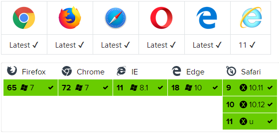

# Axios란 ?
[Axios]() 는 브라우저, Node.js를 위한 [Promise API]() 를 활용하는 HTTP 비동기 통신 라이브러리입니다.

## 기능
- 브라우저 환경 : [XMLHttpRequests](https://developer.mozilla.org/ko/docs/Web/API/XMLHttpRequest) 요청 생성
- Node.js 환경 : [http](https://nodejs.org/api/http.html) 요청 생성

- [Promise]() API 지원
- 요청/응답 차단(Intercept)
- 요청/응답 데이터 변환
- 취소 요청
- JSON 데이터 자동 변환
- [사이트 간 요청 위조(XSRF)](https://ko.wikipedia.org/wiki/%EC%82%AC%EC%9D%B4%ED%8A%B8_%EA%B0%84_%EC%9A%94%EC%B2%AD_%EC%9C%84%EC%A1%B0) 보호를 위한 클라이언트 사이드 지원

## 브라우저 호환성
axios 라이브러리 브라우저 호환성 표 입니다.

[내용출처 Axios 러능 가이드 Axios](https://xn--xy1bk56a.run/axios/guide/#axios%EB%9E%80)
