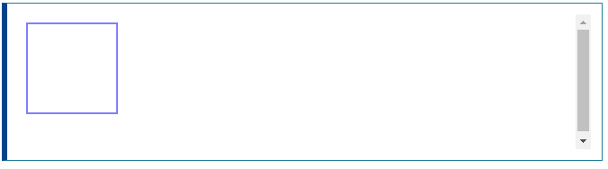
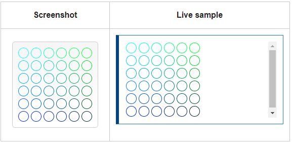

# CanvasRenderingContext2D.strokeStyle
Canvas 2D API의 ``__CanvasRenderingContext2D.strokeStyle__`` 속성은 모양 주변의 획 (육곽선)에 사용할 __색상__ , __그라데이션__ 또는 __패턴__ 을 지정합니다. 기본값은 #000 (__검은색__) 입니다.

> 획 및 채우기 스타일의 더 많은 예제는 [Canvas 자습서](https://developer.mozilla.org/en-US/docs/Web/API/Canvas_API/Tutorial)의 스타일 및 색상 적용을 참조하십시오.

## Syntax
~~~js
ctx.strokeStyle = color;
ctx.strokeStyle = gradient;
ctx.strokeStyle = pattern;
~~~

### Options

#### color
CSS ``<color>`` 값으로 구문 분석 된 DOMString입니다.  

#### gradient
[CanvasGradient](https://developer.mozilla.org/en-US/docs/Web/API/CanvasGradient) 객체 (선형 또는 방사형 그래디언트).

#### pattern
[CanvasPattern](https://developer.mozilla.org/en-US/docs/Web/API/CanvasPattern) 객체 (반복 이미지).

## Examples

### Changing the stroke color of a shape (모양의 획 색상 변경)
이 예제에서는 사각형에 파란색 획 색상을 적용합니다.

#### HTML
~~~html
<canvas id="canvas"></canvas>
~~~

#### JavaScript
~~~js
var canvas = document.getElementById('canvas');
var ctx = canvas.getContext('2d');

ctx.strokeStyle = 'blue';
ctx.strokeRect(10, 10, 100, 100);
~~~

#### Result

### Creating multiple stroke colors using loops (루프를 사용하여 여러 획 색상 만들기)
이 예제에서는 두 개의 for 루프와 [arc()](https://developer.mozilla.org/en-US/docs/Web/API/CanvasRenderingContext2D/arc) 메서드를 사용하여 각각 다른 획 색상을 가진 원 그리드를 그립니다. 이를 위해 두 개의 변수 i와 j를 사용하여 각 원에 대해 고유 한 RGB 색상을 생성하고 녹색 및 파란색 값만 수정합니다. (빨간색 채널은 고정 값입니다.)

~~~js
var ctx = document.getElementById('canvas').getContext('2d');

for (let i = 0; i < 6; i++) {
  for (let j = 0; j < 6; j++) {
    ctx.strokeStyle = `rgb(
        0,
        ${Math.floor(255 - 42.5 * i)},
        ${Math.floor(255 - 42.5 * j)})`;
    ctx.beginPath();
    ctx.arc(12.5 + j * 25, 12.5 + i * 25, 10, 0, Math.PI * 2, true);
    ctx.stroke();
  }
}
~~~

결과는 다음과 같습니다.

[내용출처 MDN strokeStyle](https://developer.mozilla.org/en-US/docs/Web/API/CanvasRenderingContext2D/strokeStyle)

