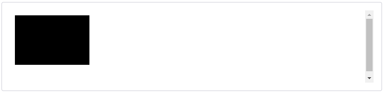
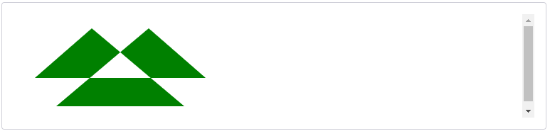

# CanvasRenderingContext2D.fill()    (fill : 채우다)
Canvas 2D API의 ``CanvasRenderingContext2D.fill()`` 메서드는 현재 또는 주어진 경로를 현재 [fillStyle](https://developer.mozilla.org/en-US/docs/Web/API/CanvasRenderingContext2D/fillStyle)으로 채웁니다.

## Syntax 구문
~~~js
void ctx.fill([fillRule]);
void ctx.fill(path [, fillRule]);
~~~

## Parameters ( 매개변수 )
### fillRule
점이 채우기 영역 내부 또는 외부에 있는지 확인하는 알고리즘입니다.   
가능한 값:
- "nonzero": [0이 아닌 감기 규칙](https://en.wikipedia.org/wiki/Nonzero-rule) , 기본 규칙
- "evenodd": [짝수-홀수 감기 규칙](https://en.wikipedia.org/wiki/Even%E2%80%93odd_rule)

### path
채울 [Path2D](https://developer.mozilla.org/en-US/docs/Web/API/Path2D) 경로입니다.

## Examples 예제
### 직사각형 채우기
이 예제에서는 ``fill()`` 메서드로 사각형을 채웁니다.

#### HTML
~~~html
<canvas id="canvas"></canvas>
~~~

#### JavaScript
~~~js
const canvas = document.getElementById('canvas');
const ctx = canvas.getContext('2d');
ctx.rect(10, 10, 150, 100);
ctx.fill();
~~~

#### Result

### 경로 및 fillRule 지정
이 예제에서는 일부 교차 선을 Path2D 개체에 저장합니다. 그런 다음 ``fill()`` 메서드를 사용하여 개체를 캔버스에 렌더링합니다. ``"evenodd"`` 규칙을 사용하여 개체의 중심에 구멍이 채워지지 않은 상태로 남습니다. 기본적으로(``"0이 아닌"`` 규칙 사용) 구멍도 채워집니다.

#### HTML
~~~html
<canvas id="canvas"></canvas>
~~~

#### JavaScript
~~~js
const canvas = document.getElementById('canvas');
const ctx = canvas.getContext('2d');

// Create path
let region = new Path2D();
region.moveTo(30, 90);
region.lineTo(110, 20);
region.lineTo(240, 130);
region.lineTo(60, 130);
region.lineTo(190, 20);
region.lineTo(270, 90);
region.closePath();

// Fill path
ctx.fillStyle = 'green';
ctx.fill(region, 'evenodd');
~~~

#### Result

[내용출처 MDN fill() 주어진 경로 채우기](https://developer.mozilla.org/en-US/docs/Web/API/CanvasRenderingContext2D/fill#specifying_a_path_and_a_fillrule)