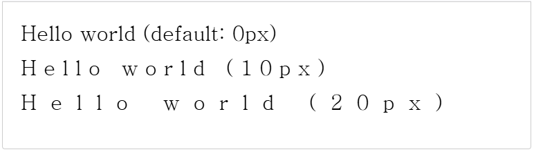

# CanvasRenderingContext2D: letterSpacing property
[Canvas API](https://developer.mozilla.org/en-US/docs/Web/API/Canvas_API)의 ``CanvasRenderingContext2D.letterSpacing`` 속성은 텍스트를 그릴 때 문자 사이의 간격을 지정합니다.  
  
이 속성은 CSS [letter-spacing](https://developer.mozilla.org/en-US/docs/Web/CSS/letter-spacing) 속성에 해당합니다.

## Value
CSS ``<length>`` 데이터 형식의 문자열 문자 간격입니다. 기본값은 0px입니다.  
  
이 속성은 간격을 가져오거나 설정하는 데 사용할 수 있습니다. 유효하지 않거나 구문 분석할 수 없는 값으로 설정된 경우 속성 값은 변경되지 않습니다.

## Examples
이 예제에서는 "Hello World" 텍스트를 세 번 표시하며, ``letterSpacing`` 속성을 사용하여 각 문자의 간격을 수정합니다. 각 문자의 간격도 속성 값을 사용하여 표시됩니다.

### HTML
~~~html
<canvas id="canvas" width="700"></canvas>
~~~

### JavaScript
~~~js
const canvas = document.getElementById("canvas");
const ctx = canvas.getContext("2d");

ctx.font = "30px serif";

// 기본 글자 간격
ctx.fillText(`Hello world (기본값: ${ctx.letterSpacing})`, 10, 40);

// 사용자 지정 글자 간격: 10px
ctx.letterSpacing = "10px";
ctx.fillText(`Hello world (${ctx.letterSpacing})`, 10, 90);

// 사용자 지정 글자 간격: 20px
ctx.letterSpacing = "20px";
ctx.fillText(`Hello world (${ctx.letterSpacing})`, 10, 140);
~~~

### Result

[내용출처 MDN](https://developer.mozilla.org/en-US/docs/Web/API/CanvasRenderingContext2D/letterSpacing)