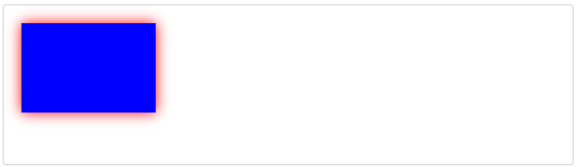

# CanvasRenderingContext2D.shadowBlur
Canvas 2D API의 __``CanvasRenderingContext2D.shadowBlur``__ 속성은 그림자에 적용되는 흐림 정도를 지정합니다. 기본값은 0(흐림 없음)입니다.

> __참고__ : 그림자는 ``shadowColor`` 속성이 투명하지 않은 값으로 설정된 경우에만 그려집니다. [``shadowBlur``](https://developer.mozilla.org/en-US/docs/Web/API/CanvasRenderingContext2D/shadowBlur), [``shadowOffsetX``](https://developer.mozilla.org/en-US/docs/Web/API/CanvasRenderingContext2D/shadowOffsetX) 또는 [``shadowOffsetY``](https://developer.mozilla.org/en-US/docs/Web/API/CanvasRenderingContext2D/shadowOffsetY) 속성 중 하나도 0이 아니어야 합니다.

## Value
그림자 흐림의 수준을 지정하는 음수가 아닌 부동 소수점. 여기서 ``0``은 흐림이 없음을 나타내고 숫자가 클수록 흐림이 점점 더 많아짐을 나타냅니다. 이 값은 픽셀 수에 해당하지 않으며 현재 변환 행렬의 영향을 받지 않습니다. 기본값은 ``0``입니다. 음수, __무한대__ 및 __NaN__ 값은 무시됩니다.

## Examples
### 모양에 그림자 추가
이 예에서는 직사각형에 흐린 그림자를 추가합니다. ``shadowColor`` 속성은 색상을 설정하고 ``shadowBlur``는 흐림 정도를 설정합니다.

#### HTML
~~~html
<canvas id="canvas"></canvas>
~~~

#### JavaScript
~~~js
const canvas = document.getElementById('canvas');
const ctx = canvas.getContext('2d');

// Shadow
ctx.shadowColor = 'red';
ctx.shadowBlur = 15;

// 직사각형
ctx.fillStyle = 'blue';
ctx.fillRect(20, 20, 150, 100);
~~~

#### Result

[내용출처 MDN 그림자 블러 효과](https://developer.mozilla.org/en-US/docs/Web/API/CanvasRenderingContext2D/shadowBlur)