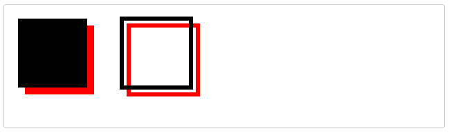
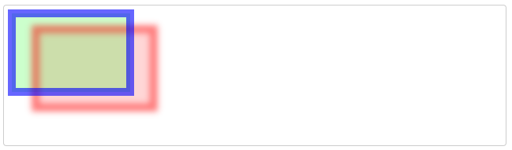

# CanvasRenderingContext2D.shadowColor
Canvas 2D API의 __``CanvasRenderingContext2D.shadowColor``__ 속성은 그림자의 색상을 지정합니다.

그림자의 렌더링된 불투명도는 칠할 때 [fillStyle](https://developer.mozilla.org/en-US/docs/Web/API/CanvasRenderingContext2D/fillStyle) 색상의 불투명도와 획을 칠 때 [strokeStyle](https://developer.mozilla.org/en-US/docs/Web/API/CanvasRenderingContext2D/strokeStyle) 색상의 불투명도에 의해 영향을 받습니다.  
  
> __참고__ : 그림자는 ``shadowColor`` 속성이 투명하지 않은 값으로 설정된 경우에만 그려집니다. [``shadowBlur``](https://developer.mozilla.org/en-US/docs/Web/API/CanvasRenderingContext2D/shadowBlur), [``shadowOffsetX``](https://developer.mozilla.org/en-US/docs/Web/API/CanvasRenderingContext2D/shadowOffsetX) 또는 [``shadowOffsetY``](https://developer.mozilla.org/en-US/docs/Web/API/CanvasRenderingContext2D/shadowOffsetY) 속성 중 하나도 0이 아니어야 합니다.

## Value
``CSS <color>`` 값으로 구문 분석된 문자열입니다. 기본값은 완전히 투명한 검정색입니다.

## Examples
### 모양에 그림자 추가
이 예에서는 두 개의 사각형에 그림자를 추가합니다. 첫 번째 것은 채워지고 두 번째 것은 획이 됩니다. ``shadowColor`` 속성은 그림자의 색상을 설정하고 ``shadowOffsetX`` 및 ``shadowOffsetY``는 모양을 기준으로 위치를 설정합니다.

#### HTML
~~~html
<canvas id="canvas"></canvas>
~~~

#### JavaScript
~~~js
const canvas = document.getElementById('canvas');
const ctx = canvas.getContext('2d');

// Shadow
ctx.shadowColor = 'red';
ctx.shadowOffsetX = 10;
ctx.shadowOffsetY = 10;

// 채워진 직사각형
ctx.fillRect(20, 20, 100, 100);

// 스트로크 직사각형
ctx.lineWidth = 6;
ctx.strokeRect(170, 20, 100, 100);
~~~

#### Result

### 반투명 모양의 그림자
그림자의 불투명도는 부모 개체의 투명도 수준에 영향을 받습니다(``shadowColor``가 완전히 불투명한 값을 지정하는 경우에도). 이 예제에서는 사각형을 반투명 색상으로 칠하고 채웁니다.

#### HTML
~~~js
<canvas id="canvas"></canvas>
~~~

#### JavaScript
채우기 그림자의 결과 알파 값은 ``.8 * .2`` 또는 ``.16``입니다. 획 그림자의 알파는 ``.8 * .6`` 또는 ``.48``입니다.
~~~js
const canvas = document.getElementById('canvas');
const ctx = canvas.getContext('2d');

// Shadow
ctx.shadowColor = 'rgba(255, 0, 0, .8)';
ctx.shadowBlur = 8;
ctx.shadowOffsetX = 30;
ctx.shadowOffsetY = 20;

// 채워진 직사각형
ctx.fillStyle = 'rgba(0, 255, 0, .2)';
ctx.fillRect(10, 10, 150, 100);

// 스트로크 직사각형
ctx.lineWidth = 10;
ctx.strokeStyle = 'rgba(0, 0, 255, .6)';
ctx.strokeRect(10, 10, 150, 100);
~~~

#### Result

[내용출처 MDN 그림자 색상](https://developer.mozilla.org/en-US/docs/Web/API/CanvasRenderingContext2D/shadowColor)