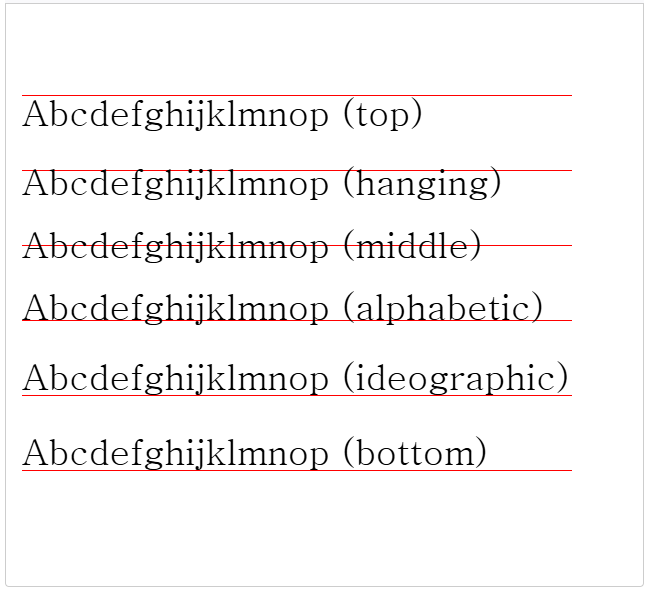
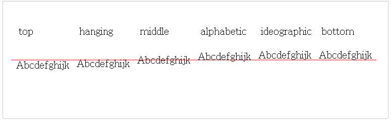

# CanvasRenderingContext2D: textBaseline property
Canvas 2D API의 ``CanvasRenderingContext2D.textBaseline`` 속성은 텍스트를 그릴 때 사용되는 현재 텍스트 기준선을 지정합니다.

## Value
가능한 값:

### "top"
텍스트 기준선은 em 사각형의 맨 위입니다.

### "hanging"
텍스트 기준선은 매달린 기준선입니다. (티베트어 및 기타 인도 문자에서 사용됨)

### "middle"
텍스트 기준선은 em 사각형의 가운데입니다.

### "alphabetic"
텍스트 기준선은 일반적인 [알파벳 기준선](https://developer.mozilla.org/en-US/docs/Glossary/Baseline/Typography)입니다. 기본값입니다.

### "ideographic"
텍스트 기준선은 표의 문자 기준선입니다. 문자 본문이 알파벳 기준선 아래로 돌출된 경우 문자 본문의 맨 아래입니다. (중국어, 일본어 및 한국어에서 사용됨)

### "bottom"
텍스트 기준선은 경계 상자의 맨 아래입니다. 표의 문자 기준선은 디센더를 고려하지 않는다는 점에서 표의 문자 기준선과 다릅니다.  
  
기본값은 ``"alphabetic"``입니다.

## Examples
### 속성 값 비교
이 예제는 다양한 ``textBaseline`` 속성 값을 보여줍니다.

#### HTML
~~~html
<canvas id="canvas" width="550" height="500"></canvas>
~~~

#### JavaScript
~~~js
const canvas = document.getElementById("canvas");
const ctx = canvas.getContext("2d");

const baselines = [
    "top",
    "hanging",
    "middle",
    "alphabetic",
    "ideographic",
    "bottom",
];
ctx.font = "36px serif";
ctx.strokeStyle = "red";

baselines.forEach((baseline, index) => {
    ctx.textBaseline = baseline;
    const y = 75 + index * 75;
    ctx.beginPath();
    ctx.moveTo(0, y + 0.5);
    ctx.lineTo(550, y + 0.5);
    ctx.stroke();
    ctx.fillText(`Abcdefghijklmnop (${baseline})`, 0, y);
});
~~~

#### Result

### 같은 줄에 있는 속성 값 비교
이전 예제와 마찬가지로 이 예제에서는 다양한 ``textBaseline`` 속성 값을 보여줍니다. 하지만 이 경우 모든 속성 값을 같은 줄에 가로로 정렬하여 서로 어떻게 다른지 더 쉽게 확인할 수 있도록 했습니다.

#### HTML
~~~html
<canvas id="canvas" width="724" height="160"></canvas>
~~~

#### JavaScript
~~~js
const canvas = document.getElementById("canvas");
const ctx = canvas.getContext("2d");

const baselines = [
    "top",
    "hanging",
    "middle",
    "alphabetic",
    "ideographic",
    "bottom",
];
ctx.font = "20px serif";
ctx.strokeStyle = "red";

ctx.beginPath();
ctx.moveTo(0, 100);
ctx.lineTo(840, 100);
ctx.moveTo(0, 55);
ctx.stroke();

baselines.forEach((baseline, index) => {
    ctx.save();
    ctx.textBaseline = baseline;
    let x = index * 120 + 10;
    ctx.fillText("Abcdefghijk", x, 100);
    ctx.restore();
    ctx.fillText(baseline, x + 5, 50);
});
~~~

#### Result

[내용출처 MDN](https://developer.mozilla.org/en-US/docs/Web/API/CanvasRenderingContext2D/textBaseline)