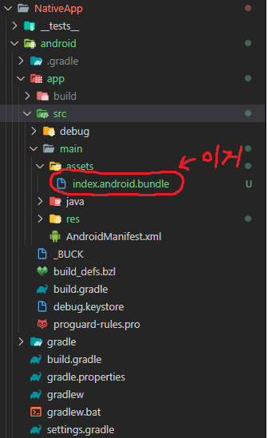
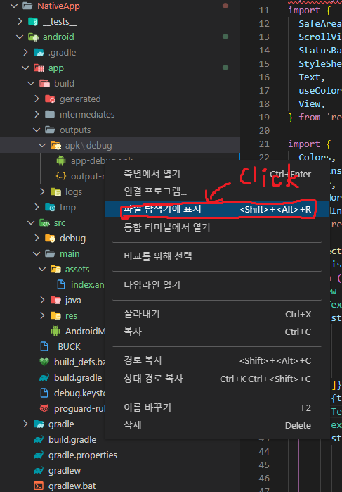

# APK 추출 방법

## android
### 1. assets 폴더 확인
android/app/src/main/assets 폴더가 있는지 확인  
없으면 assets 파일을 만들어 준다

### 2. bundle 파일 생성
인터넷에 있는 일반 방법 ( 나는 안됐다 )
> react-native bundle --platform android --dev false --entry-file index.js --bundle-output android/app/src/main/assets/index.android.bundle --assets-dest android/app/src/main/res/  
  
됐던 코드 npx를 붙여줬다
> npx react-native bundle --platform android --dev false --entry-file index.js --bundle-output android/app/src/main/assets/index.android.bundle --assets-dest android/app/src/main/res/  

  
설치가 성공했다면 위 사진 처럼 /assets에 index.android.bundle 파일이 생성 된 걸 확인할 수 있다

### 3. vscode에스 프로젝트 run-android하기
프로젝트를 한번 실행해 주면 된다
> npm run android

### 4. 추출된 .apk파일 핸드폰으로 옮기기
android/app/build/outputs/apk/debug 경로에 있는 app-debug.apk 파일을 옮겨 설치하면 된다  
  

[내용출처](https://velog.io/@ioijhioi/React-native-.apk%ED%8C%8C%EC%9D%BC-%EC%B6%94%EC%B6%9C%ED%95%98%EA%B8%B0)