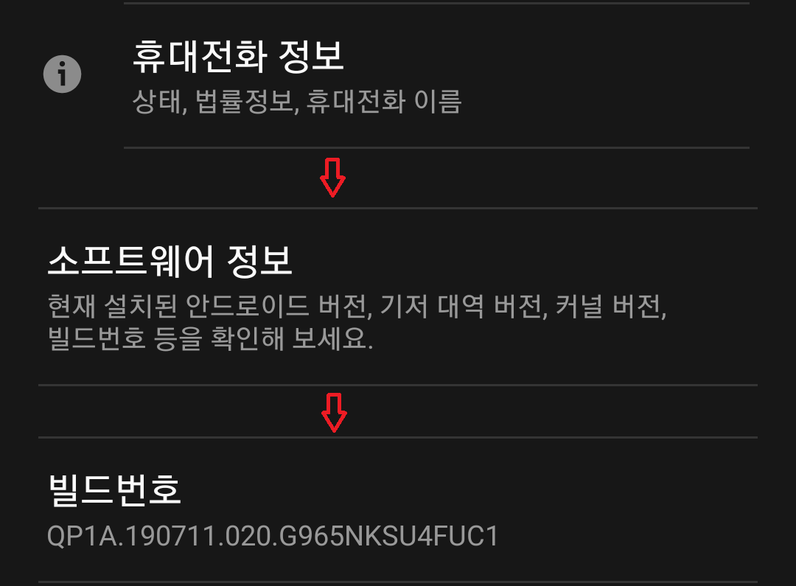

# 갤럭시 실제 기기로 연결하기
설정 -> 휴대전화 정보 -> 소프트웨어 정보

빌드번호를 여러번 누르면 __개발자모드__ 로 전환한다  
  
__개발자모드__ 가 되면 ``휴대전화 정보`` 아래에 __개발자 옵션__ 생긴다  
  
__개발자 옵션__ 으로 들어가면 __USB 디버깅__ 이 있다 (활성화 시키면 된다)

## 핸드폰으로 어플 키기
프로젝트에서 
> npm run android  
  
를 하면 핸드폰으로 어플리케이션이 켜진다  
  
### 핸드폰 연결 확인하는 법
연결된 정보 보기
> adb devices  
  
기기의 포트를 변경한다? (아직 뭔지 잘 모르겠다)
> abd reverse tcp:8081 tcp:8081
  
## USB 디버킹 끄기
__개발자 옵션__ 상단에 on/off 버튼이 있다 (off하면 꺼진다)