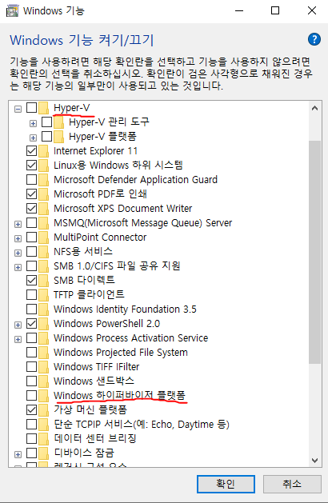
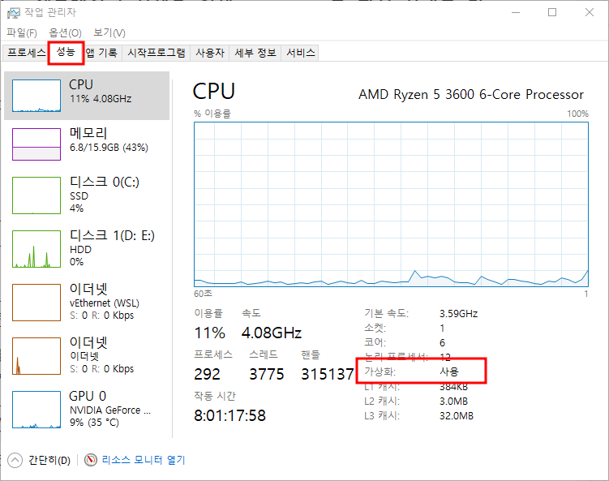

# 설치방법

## 공식 사이트
https://reactnative.dev/docs/environment-setup

## Chocolatey 설치
[Chocolatey 설치 페이지](https://chocolatey.org/install)
### powershell 명렁어
> Set-ExecutionPolicy Bypass -Scope Process -Force; [System.Net.ServicePointManager]::SecurityProtocol = [System.Net.ServicePointManager]::SecurityProtocol -bor 3072; iex ((New-Object System.Net.WebClient).DownloadString('https://community.chocolatey.org/install.ps1'))

## 노드와 Java 설치
### powershell 명렁어
[react native 공식 사이트](https://reactnative.dev/docs/environment-setup)
> choco install -y nodejs-lts openjdk11

## 안드로이드 스튜디오 설치
[안드로이드 스튜디오 설치 페이지](https://developer.android.com/studio?gclid=CjwKCAjwzNOaBhAcEiwAD7Tb6AzhxKBtcslV6reAVNVk1137r-4JLYqPTZb7IqxxhqCdjaVZ0eZr3RoCF_YQAvD_BwE&gclsrc=aw.ds)

### SDK (Software Development Kit)
#### SDK Platforms
react native는 29 , 30 버전으로 작업해야한다  
react native 프로젝트에서 ``android/build.gradle`` 파일에서 버전 확인 필요 (targetSdkVersion 보면 된다)

#### SDK Tools
- Android SDK Build-Tools는 29 ~ 31사이 버전으로 해야한다  
( Show Package Details 를 누르면 상세 설치 나온다)
- Android Emulator
- Android SDK Platform-Tools
- Intel x86 Emulator Accelerator(HAXM installer)
    - AMD인 경우 따로 설정 필요

##### CPU AMD인 경우
1. ``제어판 -> 프로그램 -> Window 기능 켜기/끄기``  에서 Hyper-v , Window 하이퍼바이저 플랫폼 체크 끄기

2. AMD Bios 가상화 설정  
    1. 컴퓨터 재부팅 시킬 때 ``F2`` 또는 ``F12``를 눌러 Bios 설정화면으로 이동  
    2. ``Advanced(고급의) -> CPU Configuration -> SVN mode`` 를 Enabled로 변경
    3. 작업관리자(Ctrl + Alt + Del) 에서 가상화 : 사용으로 변경되어 있으면 설정 완료
    
    4. SDK Tools에 ``Android Emulator Hypervisor Driver for AMD Processors (installer)`` 이 생긴다??  설치하면 된다

#### SDK 경로 
안드로이드 스튜디오에서 SDK Manager 셋팅창 상단에 보면 적혀 있는데,  
경로에 한글이 들어가면 안된다! (그래서 옮겨 줬다)
``SDK폴더/platform-tools/adb.exe`` 파일이 있어야한다. (없으면 따로 설치해야 한다)

## 환경 변수 설정
윈도우 검색창에 ``환경 변수`` 치면 나온다

### 기존에 있던 path에서 편집해서 추가
``%JAVA_HOME\bin``  
``%ANDROID_HOME%\platform-tools``  
  
두개 추가!!

### 환경변수 추가
#### ANDROID_HOME
value : SDK폴더 경로

#### JAVA_HOME
CMD(git Bash)에서 ``which javac`` 입력하면 경로가 나온다  
경로에서 bin~~부터 뒷부분 제거 후 경로 적으면 된다

## 프로젝트 시작
자, 이제 react native 프로젝트를 열고 CMD에서 ``npm run android`` 를 입력하면 emulator이 실행 된다