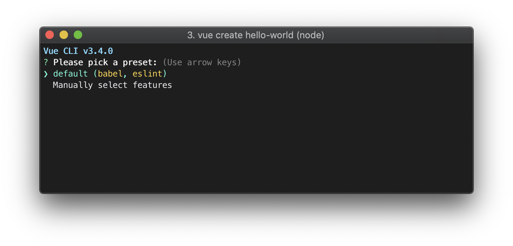
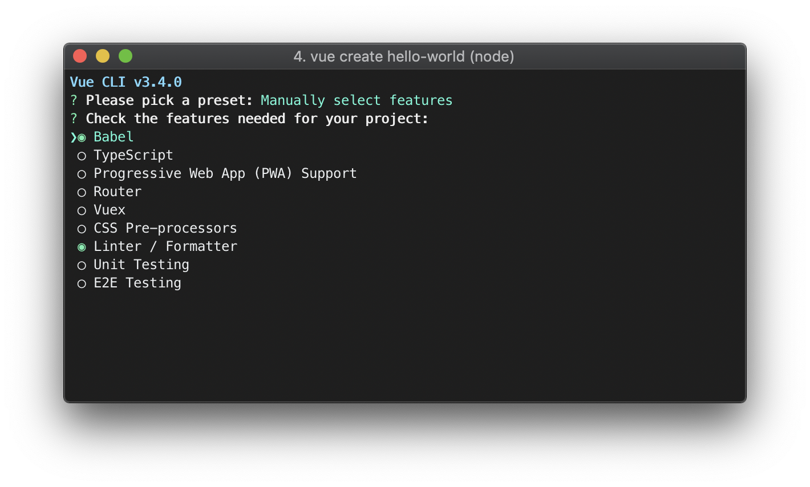

# vue create (vue 만들기)
새 프로젝트를 만들려면 다음을 실행하세요. __CMD__
~~~cmd
vue create 프로젝트이름
~~~

사전 설정을 선택하라는 메시지가 표시됩니다. 기본 Babel + ESLint 설정과 함께 제공되는 기본 사전 설정을 선택하거나 "수동으로 기능 선택"을 선택하여 필요한 기능을 선택할 수 있습니다.  

기본 설정은 새 프로젝트를 신속하게 프로토 타이핑하는 데 유용하며 수동 설정은 보다 생산 지향적인 프로젝트에 필요한 더 많은 옵션을 제공합니다.  

 기능을 수동으로 선택하도록 선택한 경우 프롬프트 끝에 선택 항목을 사전 설정으로 저장하여 나중에 다시 사용할 수 있는 옵션도 제공됩니다. 다음 섹션에서 사전 설정 및 플로그인에 대해 설명합니다. 
 > ~ / .vuere  
 저장된 사전 설정은 ``.vuerc`` 사용자 홈 디렉토리에 이름이 지정된 JSON 파일에 저장됩니다. 저장된 사전 설정 / 옵션을 수정하려면 이 파일을 편집하면 됩니다.  
 >  
 > 프로젝트 생성 프로세스 중에 선호하는 패키지 관리자를 선택하거나 더 빠른 종속성 설치를 위해 [Taobao npm 레지스트리 미러](https://developer.aliyun.com/mirror/NPM?from=tnpm) 를 사용하라는 메시지가 표시 될수도 있습니다. ``~/.vuerc`` 선택 사항도에 저장됩니다.  
   
이 ``vue create`` 명령에는 여러 옵션이 있으며 다음을 실행하여 모두 탐색 할 수 있습니다.
~~~cmd
vue create --help
~~~
~~~cmd
Usage: create [options] <app-name>

create a new project powered by vue-cli-service

Options:

  -p, --preset <presetName>       프롬프트를 건너 뛰고 저장된 사전 설정 또는 원격 사전 설정 사용

  -d, --default                   프롬프트를 건너 뛰고 기본 사전 설정 사용

  -i, --inlinePreset <json>       프롬프트를 건너 뛰고 인라인 JSON 문자열을 사전 설정으로 사용

  -m, --packageManager <command>  <명령>종속성을 설치할 때 지정된 npm 클라이언트 사용

  -r, --registry <url>            종속성을 설치할 때 지정된 npm 레지스트리 사용

  -g, --git [message|false]        git 초기화 강제 / 건너 뛰기, 선택적으로 초기 커밋 메시지 지정

  -n, --no-git                    git 초기화 건너 뛰기

  -f, --force                     대상 디렉토리가있는 경우 덮어 쓰기

  -c, --clone                     원격 사전 설정을 가져올 때 git clone 사용

  -x, --proxy                     프로젝트 생성시 지정된 프록시 사용

  -b, --bare                      Scaffold 프로젝트 (초보 지침 없음)

  -h, --help                      사용 정보 출력
~~~

[출처내용 Vue CLI 프로젝트 생성 Vue 만들기](https://cli.vuejs.org/guide/creating-a-project.html#vue-create)

## Vue webpack 설치방법
  1. CLI
  2. __프로젝트를 생성할 위치__ 로 이동
  3. ``vue init webpack-simple`` 프로젝트명 입력
  4. 생성한 프로젝트 파일로 이동 , __cd 프로젝트 파일명__
  5. ``npm i`` -> npm 설치 
  6. ``npm run dev``  -> 실행

