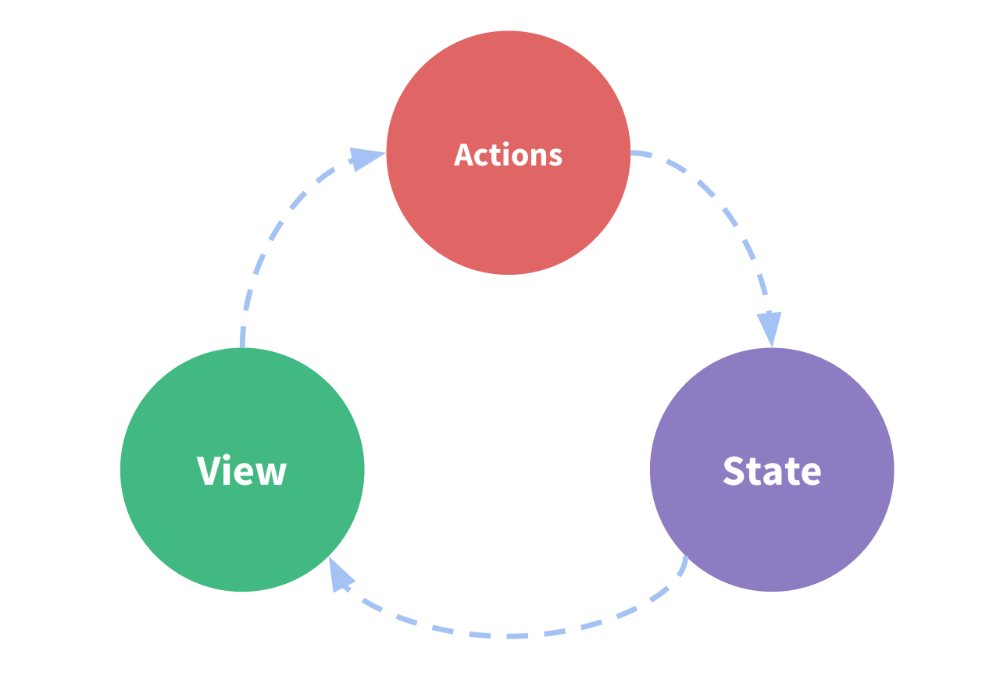

# Vuex가 무엇인가요?
Vuex는 Vue.js 애플리케이션에 대한 __상태 관리 패턴 + 라이브러리__ 입니다. 애플리케이션의 모든 컴포넌트에 대한 중앙 집중식 저장소 역할을 하며 예측 가능한 방식으로 상태를 변경할 수 있습니다. 또한 Vue의 공식 [devtools](https://github.com/vuejs/vue-devtools)과 통합되어 설정 시간이 필요 없는 디버깅 및상태 스냅 샷 내보내기/가져오기와 같은 고급 기능을 제공합니다.  

## "상태 관리 패턴" 이란 무엇인가요?
간단한 Vue 카운터 앱부터 시작 해보겠습니다.
~~~js
new Vue({
  // 상태
  data () {
    return {
      count: 0
    }
  },
  // 뷰
  template: `
    
{{ count }}

  `,
  // 액션
  methods: {
    increment () {
      this.count++
    }
  }
})
~~~
다음 과 같은 기능을 가진 앱입니다.

- __상태__ 는 앱을 작동하는 원본 소스 입니다.
- __뷰__ 는 __상태의__ 선언적 매핑입니다.
- __액션__ 은 __뷰__ 에서 사용자 입력에 대해 반응적으로 상태를 바꾸는 방법입니다.  
  
이것은 "단방향 데이터 흐름" 개념의 매우 단순한 도표입니다.

  

그러나 __공통의 상태를 공유하는 여러 컴포넌트__ 가 있는 경우 단순함이 빠르게 저하됩니다.  
  
- 여러 뷰는 같은 상태에 의존합니다.
- 서로 다른 뷰의 작업은 동일한 반영해야 할 수 있습니다.  
  
첫번째 문제의 경우, 지나치게 중첩된 컴포넌트를 통과하는 prop는 장황할 수 있으며 형제 컴포넌트에서는 작동하지 않습니다.  
두번째 문제의 경우 직접 부모/자식 인스턴스를 참조하거나 이벤트를 통해 상태의 여러 복사본을 변경 및 동기화 하려는 등의 해결 방법을 사용해야 합니다.  
> 이러한 패턴은 모두 부서지기 쉽고 유지보수가 불가능한 코드로 빠르게 변경되비다.  
  
그렇다면 컴포넌트에서 공유된 상태를 추출하고 이를 전역 싱글톤으로 관리해야 합니다. 이를 통해 우리의 컴포넌트 트리는 커다란 "뷰"가 되며 모든 컴포넌트는 트리에 상관없이 상태에 액세스하거나 동작을 트리거 할 수 있습니다!  
  
또한 상태 관리 및 특정 규칙 적용과 관련된 개념을 정의하고 분리함으로써 코드의 구조와 유지 관리 기능을 향상시킵니다.  
  
이는 [Flux](https://facebook.github.io/flux/docs/overview/) , [Redux](https://redux.js.org/) , [The Elm Architecture](https://guide.elm-lang.org/architecture/) 에서 영감을 받은 Vuex의 기본 아이디어 입니다. 다른 패턴과 달리 Vuex는 Vue.js가 효율적인 업데이트를 위해 세분화된 반응 시스템을 활용하도록 특별히 고안된 라이브러리입니다.  

  
  
## 언제 사용해야 하나요?
Vuex는 공유된 상태 고나리를 처리하는 데 유용하지만, 개념에 대한 이해와 시작하는 비용도 함께 듭니다.  
그것은 단기간과 장기간 생산성 간의 기회비용이 있습니다.  
  
대규모 SPA를 구축하지 않고 Vuex로 바로 뛰어 들었다면, 시간이 오래 걸리고 힘든일일 것입니다. 이것은 일반적인 일입니다. 앱이 단순하다면 Vuex없이는 괜찮을 것입니다. 간단한 [글로벌 이벤트 버스](https://kr.vuejs.org/v2/guide/components.html#%EB%B9%84-%EB%B6%80%EB%AA%A8-%EC%9E%90%EC%8B%9D%EA%B0%84-%ED%86%B5%EC%8B%A0) 만 있으면됩니다. 그러나 중대현 규모의 SPA를 구축하는 경우 Vue 컴포넌트 외부의 상태를 보다 잘 처리할 수 있는 방법을 생각하게 될 가능성이 있으며 Vuex는 자연스럽게 선택할 수 있는 단계가 될 것입니다. 
  
> Flux 라이브러리는 안겨오가 같습니다. 필요할 때 알아볼 수 있습니다.  
  
> __Flux__ , __Redux__ , __The Elm Architecture__ 아직 뭔지 모른다.. 기회가 된다면 공부하자

## 시작하기

모든 Vuex 애플리케이션의 중심에는 __store__ 가 있습니다. "저장소"는 기본적으로 애플리케이션 __상태__ 를 보유하고 있는 컨테이너입니다. Vuex 저장소가 일반 전역 개체와 두 가지 다른 점이 있습니다.  
  
1. Vuex store는 반응형 입니다. Vue 컴포넌트는 상태를 검색할 떄 저장소ㅡ이 상태가 변경되면 효율적으로 대응하고 업데이트합니다.  
2. 저장소의 상태를 직접 변경할 수 없습니다. 저장소의 상태를 변경하는 유일한 방법은 명시적인 __커밋을 이용한 변이__ 입니다. 이렇게하면 모든 상태에 대한 추적이 가능한 기록이 남을 수 있으며 툴을 사용하여 앱을 더 잘 이해할 수 있습니다.  

### 가장 단순한 저장소
> __참고__  
모든 예제는 ES2015 문법을 사용합니다. 사용하고 있지 않은 경우 [꼭 사용해야 합니다](https://babeljs.io/docs/en/learn)  
  
Vuex를 [설치](https://vuex.vuejs.org/kr/installation.html)한 후 저장소를 만들어 봅시다. 매우 간단합니다. 초기 상태 객체와 일부 변이를 제공하십시오.
~~~js
// 모듈 시스템을 사용하는 경우 Vue.use(Vuex)를 먼저 호출해야합니다.

const store = new Vuex.Store({
  state: {
    count: 0
  },
  mutations: {
    increment (state) {
      state.count++
    }
  }
})
~~~  
  
이제 state 객체에 ``store.state``로 전급하여 ``store.commit`` 메소드로 상태 변경을 트리거 할 수 있습니다.  
  
~~~js
store.commit('increment')

console.log(store.state.count) // -> 1
~~~

다시 말해, ``store.state.count`` 를 직접 변경하는 대신 변이를 수행하는 이유는 명시적으로 추적을 하기 때문입니다. 이 간단한 규칙에 따라 의도를 보다 명확하게 표현할 수 있으므로 코드를 읽을 때 상태 변화를 더 잘 지켜볼 수 있습니다. 또한 모든 변이를 기록하고 상태 스냅샷을 저장하거나 시간 흐름에 따라 디버깅을 할 수 있는 도구를 제공합니다.  
  
컴포넌트 안에서 저장소 상태를 사용하는 것은 단순히 계산된 속성 내에서 상태를 반환하는 것입니다. 변경을 트리거하는 것은 컴포넌트 메소드에서 변경을 커밋하는 것을 의미합니다.  
  
다음은 [가장 기본적인 __Vuex__ 카운터 앱](https://jsfiddle.net/n9jmu5v7/1269/)의 예 입니다.  
  
이제, 우리는 각 핵심 개념에 대해 더 자세히 설명 할 것입니다. [State](https://vuex.vuejs.org/kr/guide/state.html)부터 시작해 보겠습니다.  
  
[내용출처 Vuex 공식사이트](https://vuex.vuejs.org/kr/)

## 헬퍼의 유연한 문법
- Vuex에 선언한 속성을 그대로 컴포넌트에 연결하는 문법
~~~js
// 배열 리터럴
...mapMutations([
  'clickBtn', // 'clickBtn' : clickBtn
  'addNumber' // addNumber (인자)
])
~~~
- Vuex에 선언한 속성을 컴포넌트의 특정 메서드에다가 연결하는 문법
~~~js
// 객체 리터럴
...mapMutations({
  popupMsg: 'clickBtn' // 컴포넌트 메서드 명 : Store의 뮤테이션명
})
~~~
