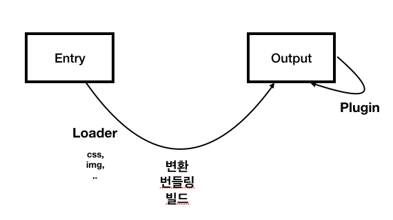

# Concepts Review 개념 컴토
여태까지 살펴본 웹팩 4가지 주요 속성을 도식으로 나타내보면 다음과 같습니다.

위 도식을 보면서 지금까지 배운 내용을 종합해보겠습니다.  
  
1. __Entry__ 속성은 웹팩을 실행할 대상 파일. 진입점
2. __Output__ 속성은 웹팩의 결과물에 대한 정보를 입력하는 속성. 일반적으로 ``filename``과 ``path``의 정의
3. __Loader__ 속성은 CSS, 이미지와 같은 비 자바스크립트 파일을 웹팩이 인식할 수 있게 추가하는 속성. 로더는 오른쪽에서 왼쪽 순으로 적용
4. __Plugin__ 속성은 웹팩으로 변환한 파일에 추가적인 기능을 더하고 싶을 때 사용하는 속성. 웹팩 변환 과정 전반에 대한 제어권을 갖고 있음
> 위 속성 이외에도 [resolve](https://webpack.js.org/configuration/resolve/#root), [devServer](https://webpack.js.org/configuration/dev-server/#root), [devtool](https://webpack.js.org/configuration/devtool/#devtool) 속성에 대해 알고 있으면 좋습니다.

[내용 출처 웹팩 핸드북 Concepts Review](https://joshua1988.github.io/webpack-guide/concepts/wrapup.html#concepts-review)

