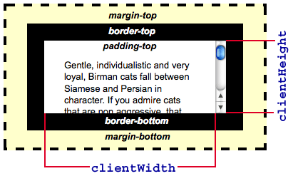

# Element.clientWidth
__``Element.clientWidth``__ 인라인 요소와 CSS가 없는 요소의 경우 속성은 0입니다. 그렇지 않으면 요소의 내부 너비(픽셀 단위)입니다. __패팅__ 은 __포함되지만__ 테두리 , 여백 및 수직 스크롤 바(있는 경우)는 제외 됩니다.  
  
``clientWidth`` 루트 요소입니다

> __참고__ : 이 속성은 값을 정수로 반올립합니다. 분수 값이 필요한 경우 [element.getBoundingClientRect()](https://developer.mozilla.org/en-US/docs/Web/API/Element/getBoundingClientRect)

## Syntax 통사론
~~~js
    var intElemClientWidth = element.clientWidth;
~~~
``intElemClientWidth``에 대응하는 정수 ``clientWidth``의 ``element`` 픽셀.  
이 ``clientWidth`` 속성은 읽기 전용입니다.

## Example 예

[내용 출처 MDN element.clientWidth](https://developer.mozilla.org/en-US/docs/Web/API/Element/clientWidth)